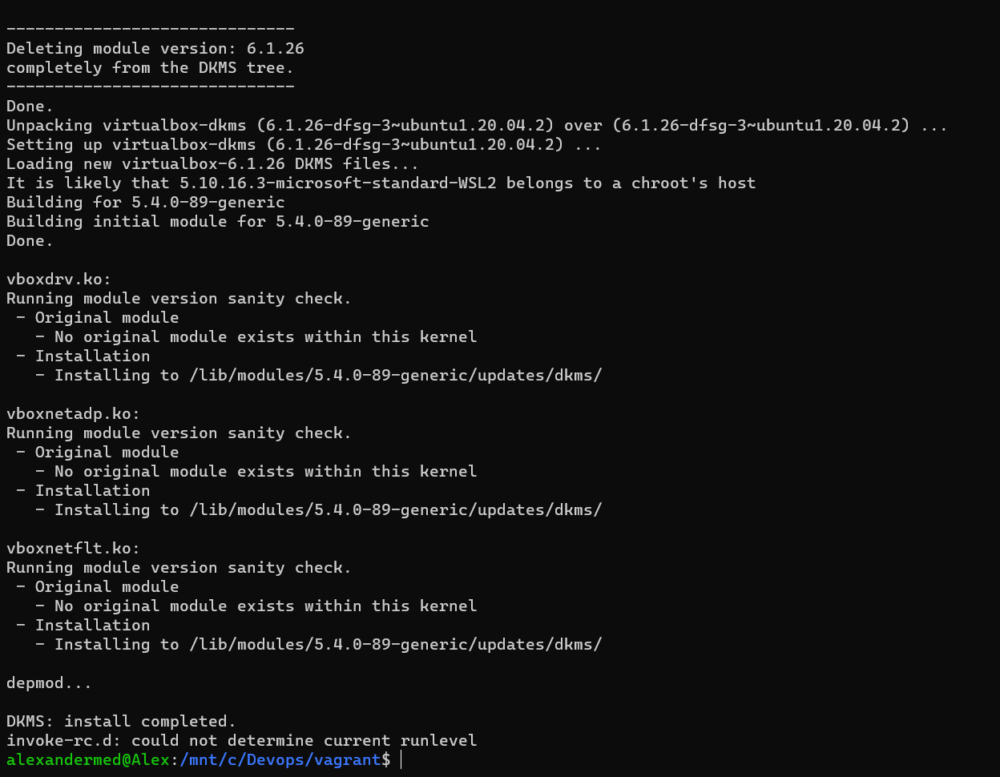

Добрый день, нужен совет по выполнению задания по работе в терминале.

Возможно, потому что никогда не работал в WSL, встретил много неожиданных вещей в ходе выполнения задания.
Никак не получается запустить vagrant в терминале через wsl. 

Я выполнил установку дистрибутивов для windows и linux, затем создал директорию для vagrant, выполнил в ней **vagrant init** и заменил содержимое файла, как описано в задании.
Также выполнил установку пакета linux-headers-generic (**sudo apt-get install linux-headers-generic**). 
Далее при запуске **vagrant up** все пошло не так, описываю последовательность действий, что я пробовал.

1. **vagrant up**

   
2. **vagrant up --provider=virtualbox**

   
3. **VBoxManage --version**

   
4. **sudo /sbin/vboxconfig**

   
5. **sudo apt-get install linux-headers-generic**

   
6. **uname -r**
**sudo apt-get install linux-headers-5.10.16.3-microsoft-standard-WSL2**
   
   
Может быть, у Вас есть идеи, с чем могут быть связаны эти проблемы, т.к. хочется разобраться, но интернет уже не дает явных подсказок. 
Заранее спасибо!

---
**Добавил скриншоты установки по полученным материалам.**

Убедился, что выполнен шаг с установкой VirtualBox для Windows (Установлен в папку C:\Soft):

Удалил имеющийся vagrant:

Установил его заново по инструкции:

Выполнил настройку и инициализацию vagrant:

Заменил содержимое Vagrantfile:

Запускаю vagrant и получаю прежние ошибки:

Найти решение по подсказкам в сообщениях ошибок также не получается:

Подозреваю, что проблема с VirtualBox, безуспешно пытался решить ее:
https://stackoverflow.com/questions/60350358/how-do-i-resolve-the-character-device-dev-vboxdrv-does-not-exist-error-in-ubu

------
После переустановки VirtualBox в директорию по умолчанию результат прежний:

Версия Linux:
