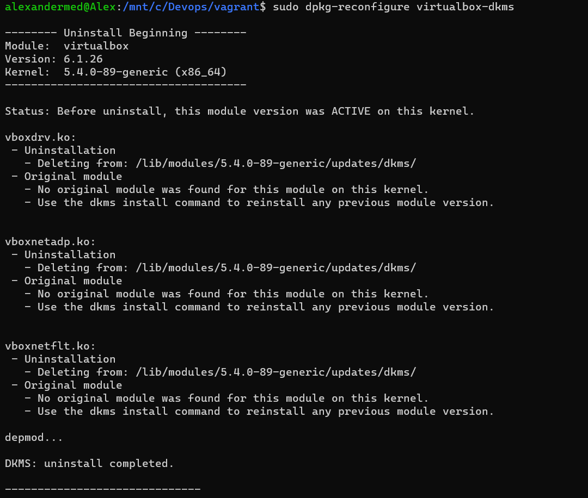
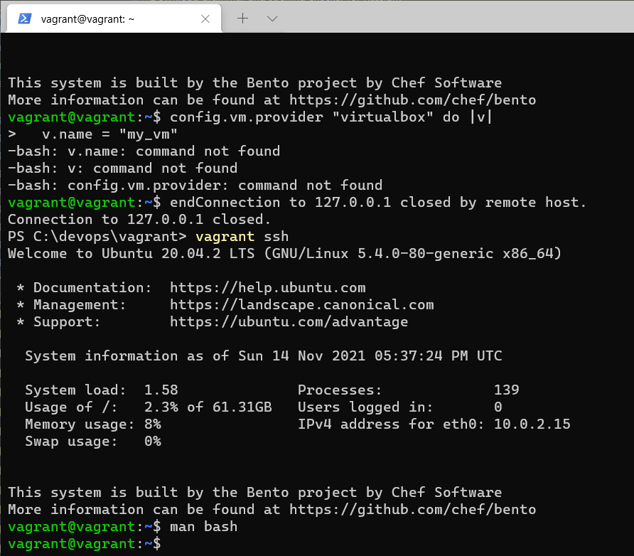

Добрый день, нужен совет по выполнению задания по работе в терминале.

Возможно, потому что никогда не работал в WSL, встретил много неожиданных вещей в ходе выполнения задания.
Никак не получается запустить vagrant в терминале через wsl. 

Я выполнил установку дистрибутивов для windows и linux, затем создал директорию для vagrant, выполнил в ней **vagrant init** и заменил содержимое файла, как описано в задании.
Также выполнил установку пакета linux-headers-generic (**sudo apt-get install linux-headers-generic**). 
Далее при запуске **vagrant up** все пошло не так, описываю последовательность действий, что я пробовал.

1. **vagrant up**

   
2. **vagrant up --provider=virtualbox**

   
3. **VBoxManage --version**

   
4. **sudo /sbin/vboxconfig**

   
5. **sudo apt-get install linux-headers-generic**

   
6. **uname -r**
**sudo apt-get install linux-headers-5.10.16.3-microsoft-standard-WSL2**
   
   
Может быть, у Вас есть идеи, с чем могут быть связаны эти проблемы, т.к. хочется разобраться, но интернет уже не дает явных подсказок. 
Заранее спасибо!

---
**Добавил скриншоты установки по полученным материалам.**

Убедился, что выполнен шаг с установкой VirtualBox для Windows (Установлен в папку C:\Soft):

Удалил имеющийся vagrant:

Установил его заново по инструкции:

Выполнил настройку и инициализацию vagrant:

Заменил содержимое Vagrantfile:

Запускаю vagrant и получаю прежние ошибки:

Найти решение по подсказкам в сообщениях ошибок также не получается:

Подозреваю, что проблема с VirtualBox, безуспешно пытался решить ее:
https://stackoverflow.com/questions/60350358/how-do-i-resolve-the-character-device-dev-vboxdrv-does-not-exist-error-in-ubu

------
После переустановки VirtualBox в директорию по умолчанию результат прежний:

Версия Linux:

---
Системная переменная VBOXINSTALLPATH:

У меня не было переменной VBOXINSTALLPATH, но была похожая VBOX_MSI_INSTALL_PATH со значением C:\Program Files\Oracle\VirtualBox\

Создал также VBOXINSTALLPATH с тем же значением:

Параметр secure boot в BIOS я отключил несколько дней назад в ходе своих попыток:

Результат запуска vagrant up не изменился:

---
Установил vagrant без WSL. Пришлось даунгрейдить VirtualBox, о версии 6.1.26, т.к. 6.1.28 видимо еще сырая, у меня в ней даже не запустилась виртуальная машина. После этого получилось:

5. Графический интерфейс VirtualBox:

   По умолчанию выделены следующие ресурсы:
   ОЗУ 1024 МБ,
   Процессоры: 2
   Память: 64 ГБ
   Видеопамять: 4МБ
   
6. Для того, чтобы изменить имя виртуальной машины и удвоить количество памяти и процессоров, Vagrantfile будет выглядеть так:
 Vagrant.configure("2") do |config|
 	config.vm.box = "bento/ubuntu-20.04"
 	config.vm.provider "virtualbox" do |v|
      v.name = "my_vm"
    end
    config.vm.provider "virtualbox" do |v|
      v.memory = 2048
      v.cpus = 4
    end
 end
   
Результат:

7. Зашел в виртуальную машину через vagrant ssh. Дальнейшие действия делаем в ней. Например, man bash:

   
8. Заходим в man bash.
С помощью команды /history, переключаясь между результатами клавишей N, ищем команду для изменения длины журнала history:
   
   
   Нужная нам строка:  The text of the last  HISTSIZE  commands (default  500)  is  saved.
Нужная переменная HISTSIZE, номер нужной строки: 2602.
   Директива ignoreboth удаляет из истории повторяющиеся записи.
   
9. Скобки {} обозначают список команд, который будет исполнен в текущем терминале shell. Список должен заканчиваться точкой с запятой. Описано в разделе Compound Commands в строке 230.

10. Команда touch {0..100000} успешно выполняется.
Команда touch {0..300000} завершается ошибкой:
    -bash: /usr/bin/touch: Argument list too long
    
Опытным путем получаем, что максимальная длина списка аргументов для этой команды равна 147058.
11. Ищем по ключу в мануале bash и находим ответ в строке 240:

[[ expression ]]
              Return a status of 0 or 1 depending on the evaluation of the conditional expression expression.  Expressions are composed of the primaries
              described below under CONDITIONAL EXPRESSIONS.  Word splitting and pathname expansion are not performed on the words between  the  [[  and
              ]]; tilde expansion, parameter and variable expansion, arithmetic expansion, command substitution, process substitution, and quote removal
              are performed.  Conditional operators such as -f must be unquoted to be recognized as primaries.
              When used with [[, the < and > operators sort lexicographically using the current locale.

А также в строке 1587:

-d file
              True if file exists and is a directory.

Выражение [[ -d /tmp ]] проверяет существование директории /tmp и возвращает True, если существует.

12. Похожий результат получился по команде 
    alias bash=/tmp/new_path_directory/bash:
    

13. Команда at используется для назначения одноразового задания на заданное время, а команда batch — для назначения одноразовых задач, которые должны выполняться, когда загрузка системы становится меньше порогового уровня.

14. vagrant halt